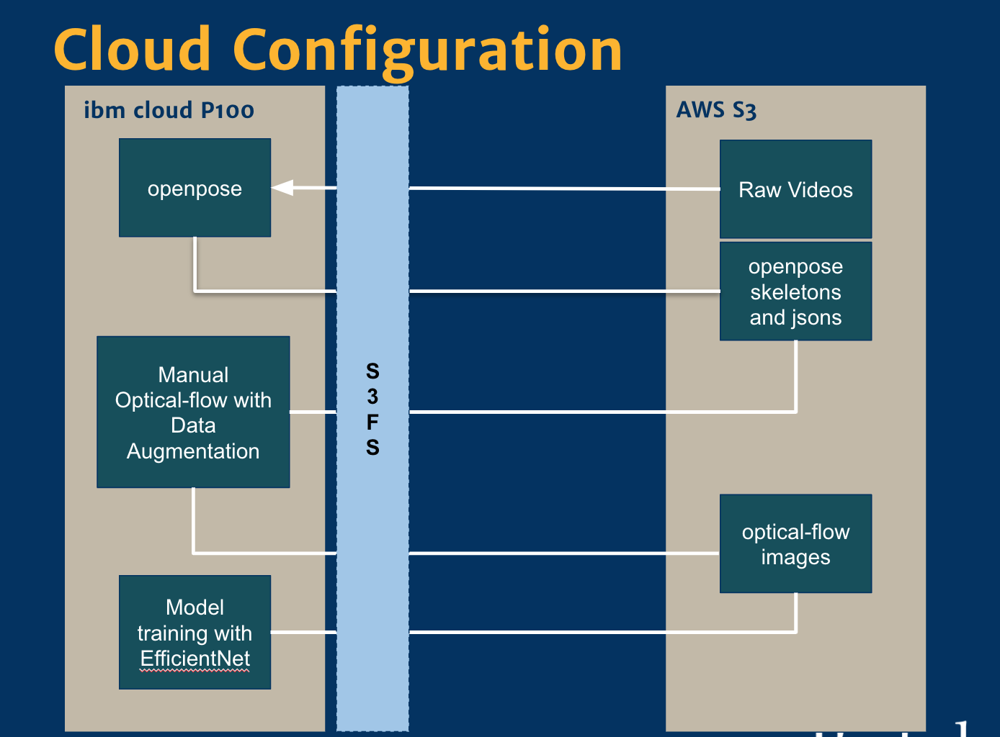

# w251-project

## What is this project about
The ability to use deep learning networks for sign language recognition has gained considerable attention over the past few years. There have been considerable advancements in using both 2D and 3D data representing letters, words and actions of the sign language to their written language translation.   
We implement an approach of training video data to achieve a considerable accuracy on inferring words when deployed on a Jetson TX2. 

Link to the final paper: https://docs.google.com/document/d/1ZkVP6Zj7xXVbppXE1y87Gxn9kITdWSRlFDxZ2U7kVcM/edit?usp=sharing  
Link to the presentation: https://docs.google.com/presentation/d/1L1PA-PZdezKvdIjhAt85fLwDmSKtzNONUBU-zVOp97Q/edit?usp=sharing

## Setup needed
### On ibmcloud
Ubuntu Linux 18.04  
CUDA  Release 10.2 - NVIDIA GPU Version  
OpenCV 3.2  
OpenPose 1.6 built from source: https://github.com/CMU-Perceptual-Computing-Lab/openpose  
s3fs-fuse from https://github.com/s3fs-fuse/s3fs-fuse  

### On Jetson TX2
Make sure you have Docker installed on Ubuntu 18.04. The Dockerfile in openpose_tx2 folder will take care of the rest. 

## Data
The dataset used in the project was the ASLLVD (American sign language lexicon video dataset) present here: 
http://csr.bu.edu/asl/asllvd/annotate/index.html
All raw data required to execute the below steps is present in AWS S3 at
https://s3.console.aws.amazon.com/s3/buckets/w251-project/data/raw/?region=us-west-1

## Steps to execute
The diagram below lists out the steps required in training the model on an ibmcloud instance. All scripts required for execution are in "ibmcloud" folder.

The scripts assume the following structure on AWS:  
w251-project  
|_____data  
        |_____raw  
        |_____processed    
=>                          |______json  
=>                          |______videos  

Also, the project uses s3fs to setup a sync between objects in AWS S3 and mounted folders on ibmcloud instance.

### Step 1: Use openpose to convert all mov files to json files  
### Step 2: Execute ibmcloud/opticalflow.py to convert these json files into optical flow images  
### Step 3: Finally execute ibmcloud/efficientnet.py to train the model  
### Step 4: Load the model (.ht file) into a suitable folder on your local machine or on the ibmcloud instance and execute the steps in W251_TensorRT.ipynb to convert it into a tensorrt graph  
### Step 5: Use the DockerFile in openpose_tx2 folder to create a container on the Jetson TX2  
### Step 6: Execute either openpose_tx2/edge_pose_detection.py (without Tensor RT) or openpose_tx2/edge_pose_detection_trt.py (with Tensor RT) for capturing a live video (from a camera attached to the TX2) and inference at run time  
